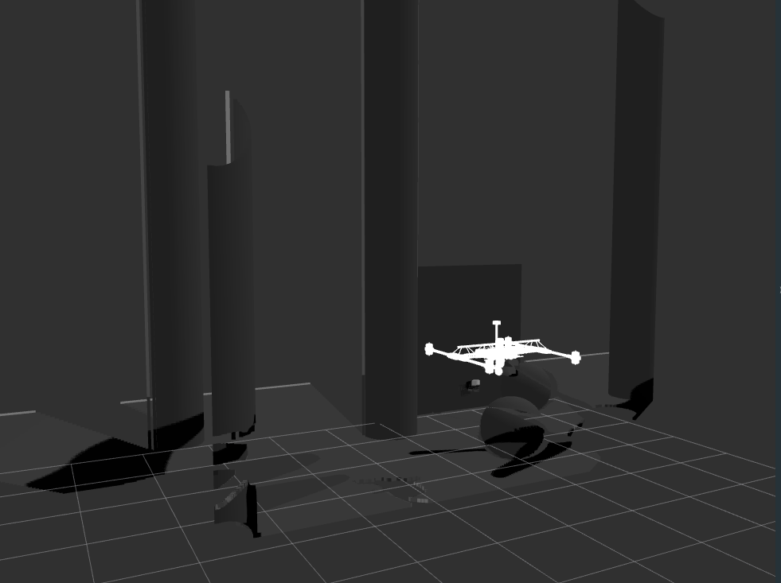
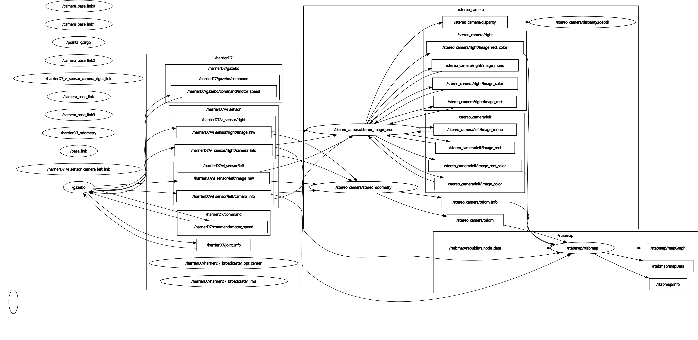

## UAV Sensor fusion Simulation (Final Year Project)

This   is  a   simulation  of   a  UAV   with  stereo   and  depth   cameras
fitted  for  localization  purposes   using  `stereo_image_proc`.  Based  on
<https://github.com/RISC-NYUAD/Aerial-Manipulator-Gazebo>

### Usage

Tested on ros-noetic with Gazebo SIM and RVIZ

- Clone into repo into catkin workspace
- Add `./assets/navigate.world` to world directory in Aerial Manipulator project
- Apply patches in `./patches/` if necessary
- `roslaunch aerial_manipulation aerial_manipulator.launch paused:=true world:=navigate`
- launch rviz and select topics to visualize

Teleoperation instruction are available in original manipulator repo
You can use `stereo_view` from `stereo_image_proc` to check cameras

## Node Graph

